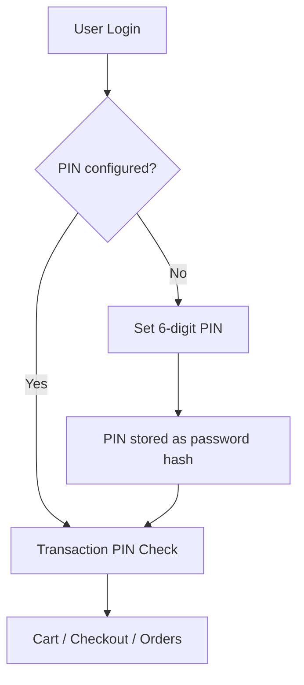
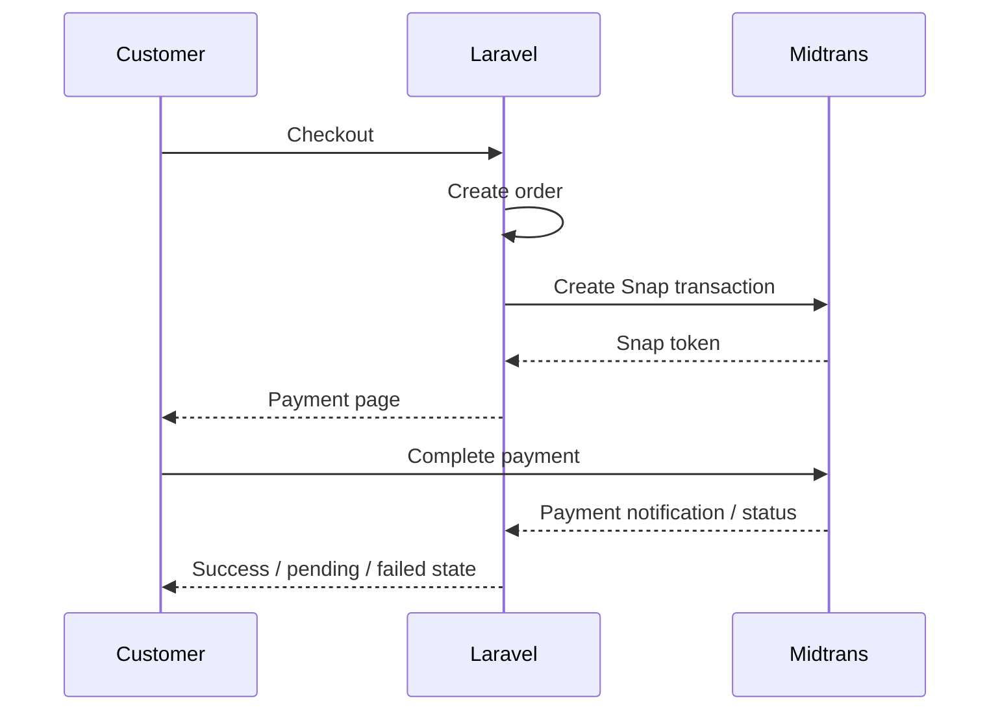
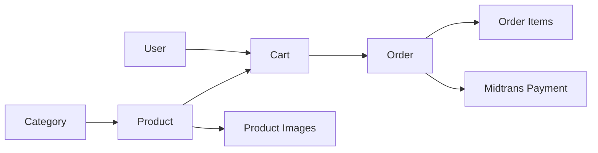

<div align="center">

# 🛍️ Jastip E-Commerce

### Laravel commerce application with transaction PIN security and Midtrans payments

[](https://laravel.com/)
[](https://livewire.laravel.com/)
[](https://midtrans.com/)
[](#transaction-pin-security)

</div>

---

## Overview

**Jastip E-Commerce** is a Laravel-based personal-shopping storefront with product browsing, cart and checkout workflows, order management, Midtrans payment integration, and an additional **6-digit transaction PIN** for authenticated customer transactions.

The project separates customer and administrator workflows while keeping payment and transaction operations protected behind authentication and application-level PIN verification.

## Customer Features

- Browse storefront without login
- Browse shop / product catalogue
- View product details
- Register and login
- Set a 6-digit transaction PIN
- Add products to cart
- Update cart quantities
- Remove cart items
- Checkout with customer and address information
- Create orders
- View order history
- View order detail
- Continue to payment
- View payment success, pending, or failed states
- Profile, password, appearance, and two-factor settings

## Admin Features

- Protected admin dashboard
- Product management
- Product image support
- Category management
- View customer orders
- View order detail
- Update order status

## Transaction PIN Security

A logged-in customer must configure a **6-digit PIN** before accessing sensitive transaction flows.



The PIN is hashed before storage rather than saved as plain text.

## Payment Flow



The current Midtrans service is configured for the **sandbox / non-production environment**.

## Tech Stack

| Area | Technology |
| --- | --- |
| Framework | Laravel 12 |
| Language | PHP 8.2+ |
| UI | Blade + Livewire + Flux |
| Authentication | Laravel Fortify |
| Two-Factor Settings | Fortify / Livewire |
| Payments | Midtrans Snap |
| Security | Transaction PIN middleware |
| Database | Eloquent ORM |
| Frontend Build | Vite |
| Testing | PHPUnit |

## Main Architecture

```text
app/
├── Actions/Fortify/
├── Http/
│   ├── Controllers/
│   │   ├── Admin/
│   │   ├── CartController.php
│   │   ├── CheckoutController.php
│   │   ├── OrderController.php
│   │   ├── PaymentController.php
│   │   └── PinController.php
│   └── Middleware/
│       ├── CheckTransactionPin.php
│       └── IsAdmin.php
├── Models/
│   ├── Product.php
│   ├── ProductImage.php
│   ├── Category.php
│   ├── Cart.php
│   ├── Order.php
│   └── OrderItem.php
├── Livewire/
└── Services/
    └── MidtransService.php
```

## Domain Flow



## Installation

### Requirements

- PHP 8.2+
- Composer
- Node.js & npm
- Database supported by Laravel
- Midtrans sandbox account for payment testing

### 1. Clone

```bash
git clone https://github.com/bayupra7ama/jastip-ecommerce.git
cd jastip-ecommerce
```

### 2. Install dependencies

```bash
composer install
npm install
```

### 3. Environment

```bash
cp .env.example .env
php artisan key:generate
```

Configure your database and Midtrans credentials in `.env`.

Example:

```env
MIDTRANS_SERVER_KEY=
MIDTRANS_CLIENT_KEY=
```

### 4. Database

```bash
php artisan migrate
php artisan db:seed
```

### 5. Run

```bash
composer run dev
```

Or:

```bash
php artisan serve
npm run dev
```

## Production Checklist

Before production deployment:

- switch Midtrans from sandbox to production configuration
- use HTTPS
- secure webhook endpoints
- configure trusted callback URLs
- protect environment secrets
- review transaction PIN attempt limits / rate limiting
- configure queues and logging appropriately

---

<div align="center">

Commerce workflow with an extra security layer for customer transactions.

</div>
